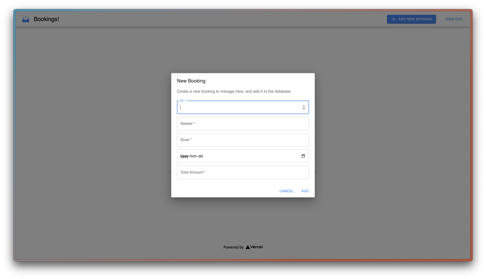
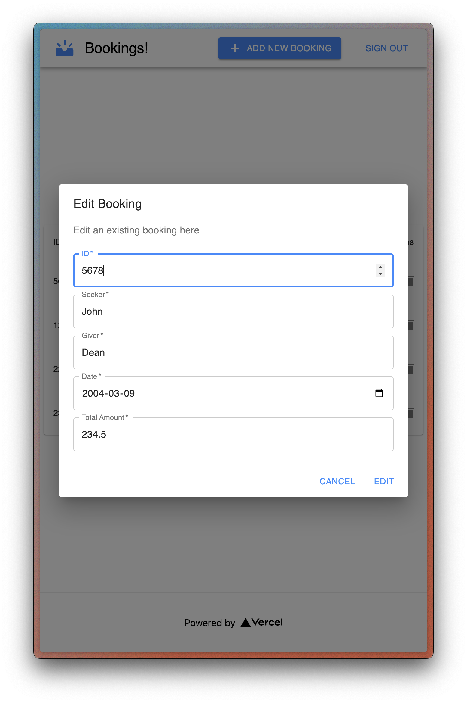

## The Problem

For businesses, bookings can be somewhat of a hassle to keep track of, especially when multiple workers are involved. Therefore I created Bookings!, a web application that allows businesses to keep track of multiple bookings within different accounts, and to easily manage them.

## The Solution

Bookings! is a web application that allows businesses to keep track of multiple bookings within different accounts, and to easily manage them.

## Technical Details

- **Frontend**: React.js + Material UI
- **Backend**: Next.js
- **Hosting/Deployment**: Vercel
- **Authentication and Storage**: Google Firebase

## My Role

I worked as a full-stack developer on this project, working on both the frontend and backend of the app. I created this app over the course of a week as a passion project, to test new technologies and to improve my skills.

## Key Challenges & Solutions

**Challenge**: Utilizing modern frameworks and different technical solutions.
**Solution**: Researched various ideas for integration and middleware to find good web stacks.

## App Screenshots

## [Try it out!](https://bookings-manager.vercel.app/)
