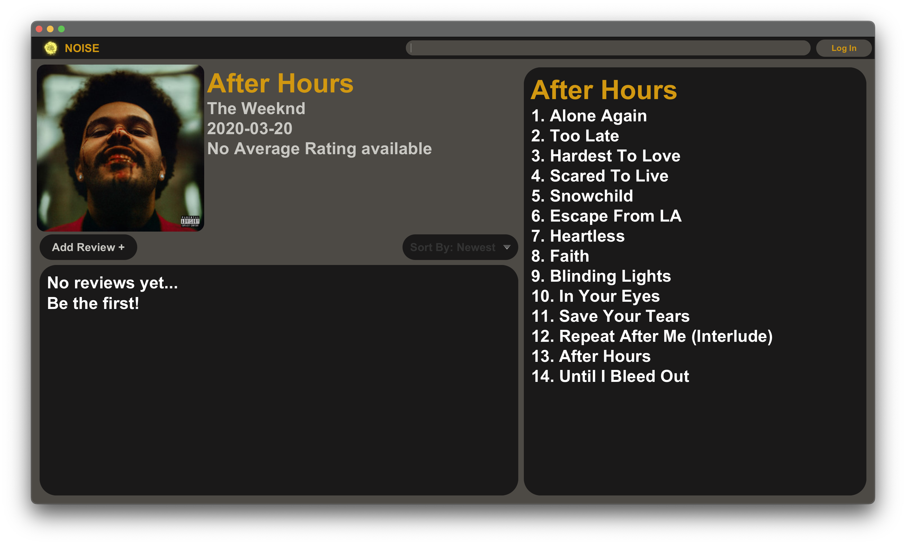
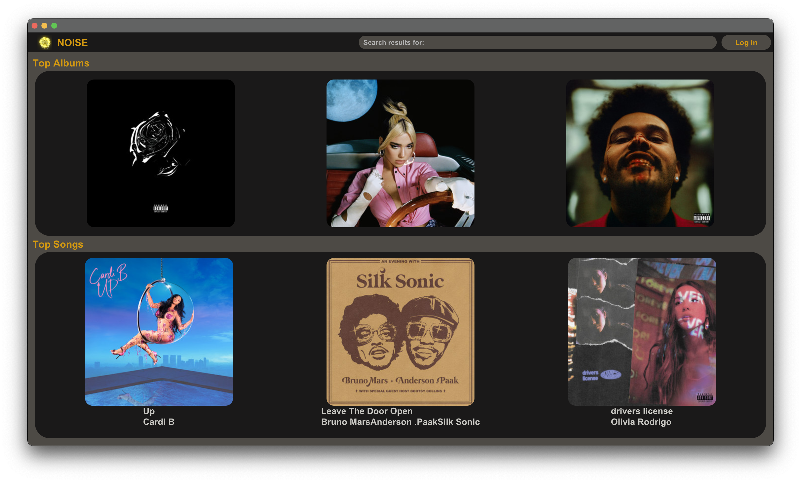
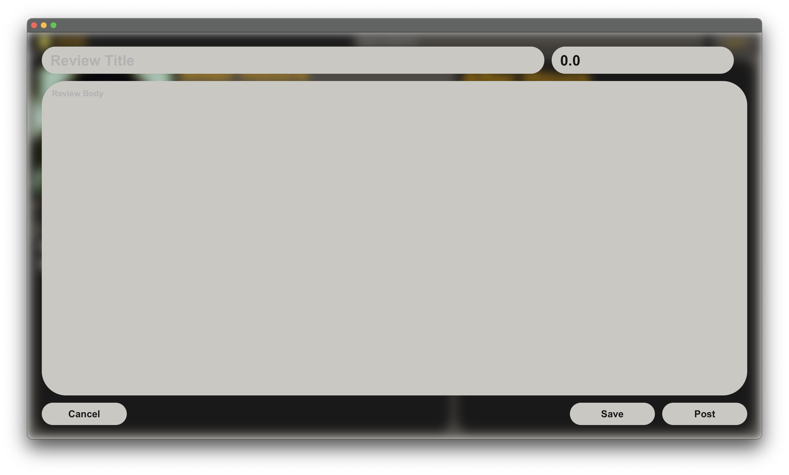
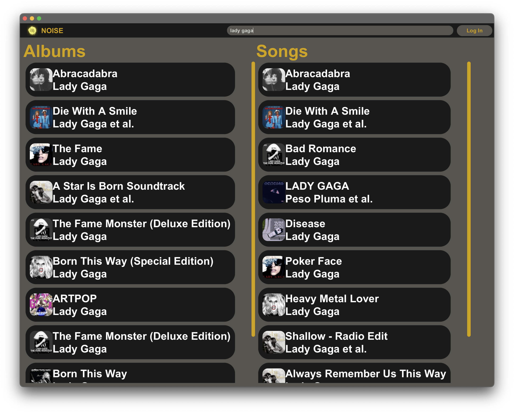

## The Problem

In the world of music, it's hard to keep track of all the albums and singles you've listened to, and even harder to remember what you thought of them! We wanted to create an app that would allow users to keep track of their favourite music, and to share their reviews with others.

There also isn't a particular platform where one can review music as well as see what's available on the streaming services at the same time. Sites like Metacritic exist, but
they do not offer good interfaces or are severely limited for non-critics. We wanted to make that experience available for everyone, so that people could have more access
to music reviews from their fellow Spotify users.

## The Solution

Noise is a desktop application, which is intuitive and offers easy access to album and singles information, to allow users to review their favourite (or most hated!) music. It saves your reviews according to your Spotify credentials, and reviews are readable based on the Spotify id of the album/single.

## Technical Details

- **Frontend**: JavaFX + Java
- **Backend**: Java + Kotlin
- **Database**: MongoDB for flexible document storage
- **Authentication**: Built-in Spotify authentication
- **Testing**: Kotlin Testing Library
- **Architecture**: Model-View-Controller (MVC) pattern

## My Role

I worked as a middle to backend developer on this project, working on the backend and the middleware of the app. I worked with a small team of fellow students to create this app over the course of a semester.

## Key Challenges & Solutions

**Challenge**: Creating a modern UI with JavaFX.
**Solution**: Implemented various approaches with generic classes to give a more modern apple-esque look to the app.

**Challenge**: Utilizing Spotify integration natively, and creating databases that synced with the Spotify data.
**Solution**: Created our own database with MongoDB, which included the Spotify id for each album/single to keep track of it.

## App Screenshots

